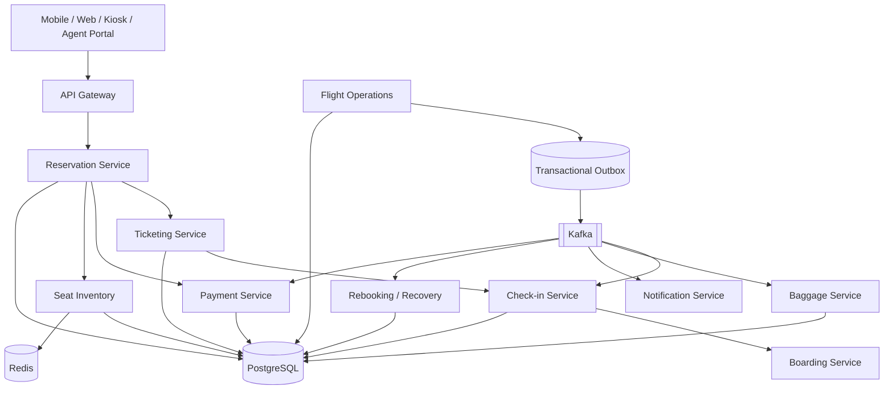
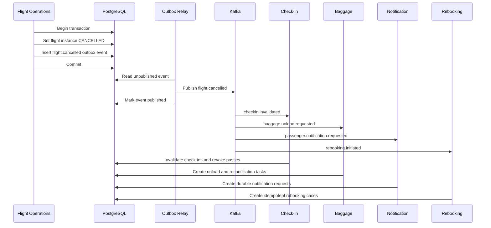
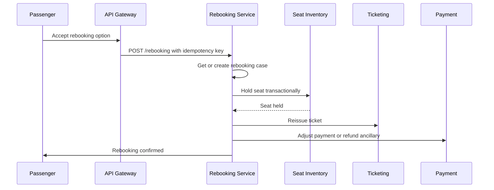

# Architecture Diagrams

## High-level architecture

```mermaid
flowchart TD
  Client[Mobile / Web / Kiosk / Agent Portal]
  Gateway[API Gateway]

  Reservation[Reservation Service]
  Ticketing[Ticketing Service]
  Payment[Payment Service]
  Seats[Seat Inventory]
  Checkin[Check-in Service]
  Baggage[Baggage Service]
  Ops[Flight Operations]
  Boarding[Boarding Service]
  Notify[Notification Service]
  Recovery[Rebooking / Recovery]

  Outbox[(Transactional Outbox)]
  Kafka[[Kafka]]
  DB[(PostgreSQL)]
  Redis[(Redis)]

  Client --> Gateway
  Gateway --> Reservation
  Reservation --> Ticketing
  Reservation --> Payment
  Reservation --> Seats
  Ticketing --> Checkin
  Checkin --> Boarding
  Ops --> Outbox
  Outbox --> Kafka
  Kafka --> Checkin
  Kafka --> Baggage
  Kafka --> Notify
  Kafka --> Recovery
  Kafka --> Payment
  Reservation --> DB
  Ticketing --> DB
  Payment --> DB
  Seats --> DB
  Checkin --> DB
  Baggage --> DB
  Ops --> DB
  Recovery --> DB
  Seats --> Redis
```

## Cancellation sequence

```mermaid
sequenceDiagram
  participant Ops as Flight Operations
  participant DB as PostgreSQL
  participant Relay as Outbox Relay
  participant K as Kafka
  participant CI as Check-in
  participant BG as Baggage
  participant N as Notification
  participant R as Rebooking

  Ops->>DB: Begin transaction
  Ops->>DB: Set flight instance CANCELLED
  Ops->>DB: Insert flight.cancelled outbox event
  Ops->>DB: Commit

  Relay->>DB: Read unpublished event
  Relay->>K: Publish flight.cancelled
  Relay->>DB: Mark event published

  K->>CI: checkin.invalidated
  K->>BG: baggage.unload.requested
  K->>N: passenger.notification.requested
  K->>R: rebooking.initiated

  CI->>DB: Invalidate check-ins and revoke passes
  BG->>DB: Create unload and reconciliation tasks
  N->>DB: Create durable notification requests
  R->>DB: Create idempotent rebooking cases
```

## Rebooking sequence

```mermaid
sequenceDiagram
  participant P as Passenger
  participant API as API Gateway
  participant R as Rebooking Service
  participant S as Seat Inventory
  participant T as Ticketing
  participant Pay as Payment

  P->>API: Accept rebooking option
  API->>R: POST /rebooking with idempotency key
  R->>R: Get or create rebooking case
  R->>S: Hold seat transactionally
  S-->>R: Seat held
  R->>T: Reissue ticket
  R->>Pay: Adjust payment or refund ancillary
  R->>P: Rebooking confirmed
```
